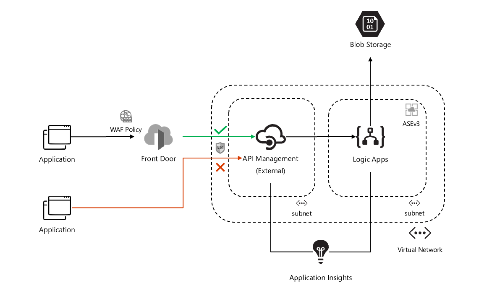
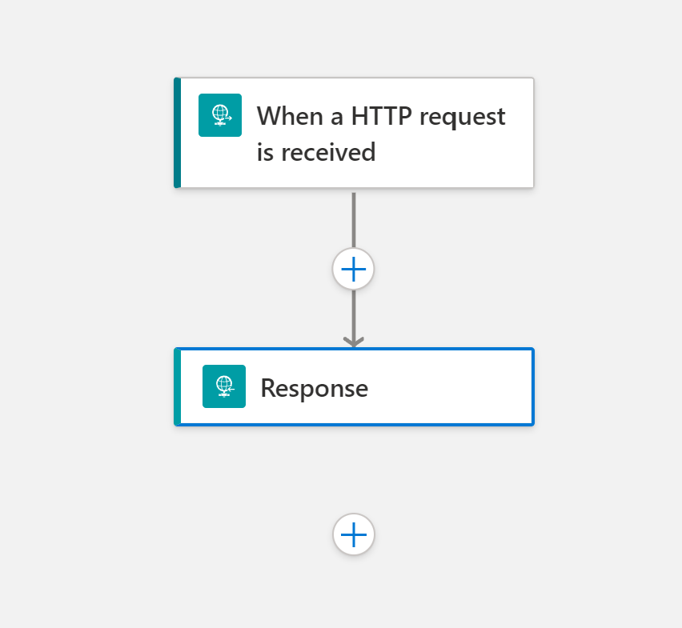

# ais-sync-pattern-la-std-vnet

## Build Status

| GitHub Action | Status |
| ----------- | ----------- |
| Build | [](https://github.com/pascalvanderheiden/ais-sync-pattern-la-std-vnet/actions/workflows/build.yml) |
| Release | [](https://github.com/pascalvanderheiden/ais-sync-pattern-la-std-vnet/actions/workflows/release.yml) |

## About

Deploy a Logic App synchronous pattern VNET isolated in a App Service Environment exposed via Front Door and API Management. This deployment can be done by Github Actions or manually.

To setup API Management with Azure Front Door, I used this [deployment script](https://github.com/Azure/azure-quickstart-templates/tree/master/quickstarts/microsoft.network/front-door-api-management).

I also used [this blog](https://techcommunity.microsoft.com/t5/azure-paas-blog/integrate-azure-front-door-with-azure-api-management/ba-p/2654925) to get more insights on the process.

To also enable a Web Application Firewall (WAF) in Front Door, I used [this](https://docs.microsoft.com/en-us/azure/web-application-firewall/afds/waf-front-door-create-portal) guide.

In my journey I ran into some networking related issue's. When you are deploying APIM in external mode, everything routes through the VNET. So, this means you still have to open some ports in the Network Security Groups attached to the APIM Subnet, in order to get API Management running appropiattely. Here is a [link](https://docs.microsoft.com/en-us/azure/api-management/api-management-using-with-vnet?tabs=stv2#control-plane-ip-addresses) which tells you which ports to open.

For deployment I choose to do it all in Bicep templates. I got most of my examples from [here](https://github.com/Azure/bicep/tree/main/docs/examples).

For deploying the Logic App (Standard) via [Github Actions](https://github.com/Azure/logicapps/tree/master/github-sample).
For deploying the Logic App (Standard) via [Azure DevOps](https://github.com/Azure/logicapps/tree/master/azure-devops-sample).

Last but not least, I used Azure Storage to deploy the workflow to my Logic App. Because you can not reach the kudo endpoint for performing a zip deployment due to the fact that the ASE is a completely isolated environment, I used a file share to deploy the workflow. I based this strategy on this [blog](https://techcommunity.microsoft.com/t5/integrations-on-azure-blog/deploying-standard-logic-app-to-storage-account-behind-firewall/ba-p/2626286)
An other approach for deploying the Logic App workflow within a isolated environment, is by setting up a build agent within the isolated environment.

> At first I deployed this solution without the check-header policy. With only the NSG check on Frontdoor.Backend, you could setup your own Frontdoor and connect it directly to my APIM Instance, if you would had known the name of my instance. Quite often this name is pretty easy to guess. This security breach would be eliminated by adding a header check on the Front Door id in the X-Azure-FDID header. Kudo's to Remco Eissing for pointing that out to me.

## Architecture



## Prerequisites

* Install [Visual Studio Code](https://code.visualstudio.com/download)
* Install [Azure Logic Apps (Standard)](https://marketplace.visualstudio.com/items?itemName=ms-azuretools.vscode-azurelogicapps) Extension for Visual Studio Code.
* Install [Azurite](https://marketplace.visualstudio.com/items?itemName=Azurite.azurite) Extension for Visual Studio Code.
* Install [REST Client](https://marketplace.visualstudio.com/items?itemName=humao.rest-client) Extension for Visual Studio Code.
* Install Chocolatey (package manager)

```ps1
Set-ExecutionPolicy Bypass -Scope Process -Force; [System.Net.ServicePointManager]::SecurityProtocol = [System.Net.ServicePointManager]::SecurityProtocol -bor 3072; iex ((New-Object System.Net.WebClient).DownloadString('https://community.chocolatey.org/install.ps1'))
```

* Install Azure Function Core Tools (x64 is needed for debugging)

```ps1
choco install azure-functions-core-tools-3 --params "'/x64'"
```

* Install .NET Core SDK

```ps1
choco install dotnetcore-sdk --params "'/x64'"
```

* Install Bicep CLI

```ps1
choco install bicep
```

* Install Az Module in PowerShell

```ps1
Install-Module -Name Az -AllowClobber -Scope CurrentUser
```

* Install Logic App Azure Cli extensions

```ps1
az extension add --name logic
az extension add --yes --source "https://aka.ms/logicapp-latest-py2.py3-none-any.whl"
```

## Deploy Manually

* Git Clone the repository

```ps1
git clone https://github.com/pascalvanderheiden/ais-sync-pattern-la-std-vnet.git
```

* Create a Logic App Standard locally

Now everything is setup to create your first workflow. In order to follow an agile development process I use [Visual Studio Code to create my Logic Apps (Standard)](https://docs.microsoft.com/en-us/azure/logic-apps/create-single-tenant-workflows-visual-studio-code) and I use Github to sync, share, deploy & collaborate my code.

I've already prepared a simple request and response workflow in this repository. Which we can deploy via Visual Studio Code or the Az Cli.



* Deploy it all by one script

I've included all the steps in 1 Powershell script. This will create all the needed resources, and will deploy the Logic App and the API in API Management. Keep in mind that this will take a while to deploy.

I've used these variables:

```ps1
$subscriptionId = "<subscription_id>"
$deploymentNameBuild = "<deployment_name_build>"
$deploymentNameRelease = "<deployment_name_release>"
$namePrefix = "<project_prefix>"
$workflowName = "<workflow_name>"
$apiName = "<api_name>"
$apiPath = "<api_path>"
# For removing soft-delete
$apimName = "<apim_name>"
```

```ps1
.\deploy\manual-deploy.ps1 -subscriptionId $subscriptionId -deploymentNameBuild $deploymentNameBuild -deploymentNameRelease $deploymentNameRelease -namePrefix $namePrefix -workflowName $workflowName -apiName $apiName -apiPath $apiPath
```

* Remove the APIM Soft-delete

If you deleted the deployment via the Azure Portal, and you want to run this deployment again, you might run into the issue that the APIM name is still reserved because of the soft-delete feature. You can remove the soft-delete by using this script:

```ps1
.\deploy\del-soft-delete-apim.ps1 -subscriptionId $subscriptionId -apimName $apimName
```

* Testing

I've included a tests.http file with relevant Test you can perform, to check if your deployment is successful.

## Deploy with Github Actions

* Fork this repository

* Generate a Service Principal

```ps1
az ad sp create-for-rbac -n <name_sp> 
```

Copy the json output of this command.

* Update GitHub Secrets for customizing your deployment

In the repository go to 'Settings', on the left 'Secrets', 'Actions'.
And pass the json output in the command used above into the secret 'AZURE_CREDENTIALS'.

The following secrets need to be created:

* AZURE_SUBSCRIPTION_ID
* LOCATION
* DEPLOYMENT_NAME_BUILD
* DEPLOYMENT_NAME_RELEASE
* PREFIX
* API_NAME
* API_PATH
* WORKFLOW_NAME

### Commit

Commit the changes, and this will trigger the CI Build Pipeline.
